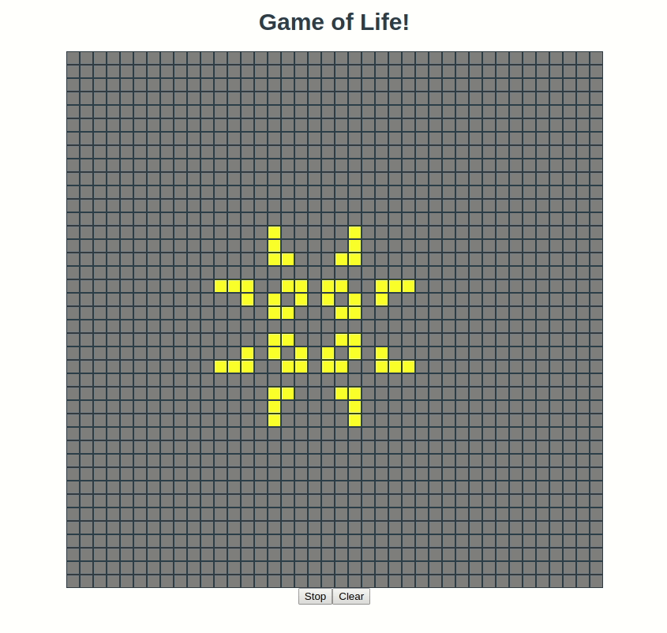

An Elm implementation of [Conway's Game of Life](https://en.wikipedia.org/wiki/Conway%27s_Game_of_Life)

## Run
```bash
# Install create-elm-app
yarn global add create-elm-app
# Or with NPM
npm i -g create-elm-app

# Clone and enter repo
git clone https://github.com/MainShayne233/elm-game-of-life
cd elm-game-of-life

# Start app
elm-app start
```

